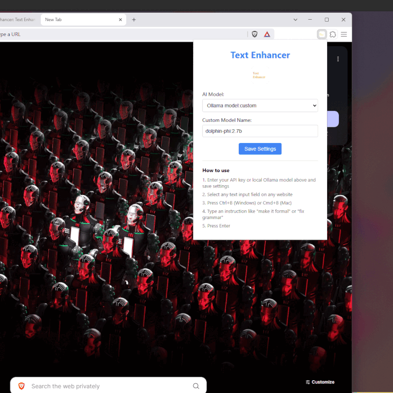

# Text Enhancer Browser Extension

<div align="center">


**Transform your writing with AI-powered enhancements using a simple keyboard shortcut**  
*Compatible with Chrome, Arc, Brave, and all Chromium-based browsers*

[Features](#-features) • [Installation](#-installation) • [Setup](#-setup) • [Usage](#-usage) • [FAQ](#-faq) • [Contributing](#-contributing)

</div>

## 🚀 Overview

Text Enhancer is a lightweight browser extension that helps you improve your writing anywhere on the web. Whether you're composing emails, writing social media posts, or commenting on articles, Text Enhancer acts like a "linter for text" - giving you instant AI-powered suggestions to enhance your writing with a simple keyboard shortcut.



## ✨ Features

- **Instant Access**: Summon the enhancer with `Ctrl+B` (Windows/Linux) or `Cmd+B` (Mac) in any text field
- **Multiple AI Options**:
  - **Ollama** (Free & Local): Enhance text with your locally running AI models
  - **OpenAI**: Access GPT models for precise text refinements
  - **Anthropic**: Leverage Claude models for nuanced writing improvements
- **Clean, Minimal Interface**: Distraction-free popup inspired by modern code editors
- **Context-Aware**: Works with selected text or entire input fields
- **Privacy-First**: All API keys stored locally in your browser

## 📦 Installation

### Option 1: Install from Source (Developer Mode)

1. Clone the repository
   ```bash
   git clone https://github.com/DebBidhi/text-enhancer.git
   ```

2. Open your browser's extension page:
   - Chrome/Brave/Edge: Go to `chrome://extensions/`
   - Arc: Go to `arc://extensions/`

3. Enable "Developer mode" (toggle in top-right corner)

4. Click "Load unpacked" and select the `text-enhancer` folder

5. The extension icon should now appear in your browser toolbar

### Option 2: Chrome Web Store

*Coming soon*

## ⚙️ Setup

1. Click the Text Enhancer icon in your browser toolbar
2. Choose your preferred AI provider:
   - **Ollama** (default): Free local AI
   - **OpenAI**: GPT models
   - **Anthropic**: Claude models
3. Enter your API key (if required)
4. Click "Save Settings"

### Ollama Configuration

For local AI processing with Ollama:

1. Install [Ollama](https://ollama.com/) on your computer
2. For best results, use smaller models (1B-3B parameters) for faster response times
3. Start Ollama with CORS enabled for the extension:
4. Set environment variable `OLLAMA_ORIGINS=chrome-extension://*`
*You may need to kill all Ollama processes and then serve again; otherwise, you’ll get an Ollama 403 error.*

6. For `"Unhinged Mode"`, install the uncensored model:
   ```bash
   ollama pull dolphin-phi:2.7b
   ```

## 🎯 Usage

1. Focus on any text field on any website
2. Type or paste your text and select the text you want to replace
3. Press `Ctrl+B` (Windows/Linux) or `Cmd+B` (Mac)
4. In the popup, enter your instruction (e.g., "fix grammar", "sound more professional")
5. Press Enter or click "Enhance"
6. Your text will be transformed according to your instructions!

### Example Instructions

| Instruction | Result |
|-------------|--------|
| "Fix grammar and spelling" | Corrects errors while preserving content |
| "Make this more concise" | Shortens text while maintaining key points |
| "Sound more professional" | Adopts formal tone and business terminology |
| "Add more enthusiasm" | Increases energy and positive language |
| "Write like Shakespeare" | Transforms text with Elizabethan style |
| "Make it a insult" | Perfect for "Unhinged Mode" - unpredictable and creative results! |

## 🔒 Privacy & Security

- **Local Storage**: All API keys stored securely in your browser
- **Direct Communication**: Text sent directly from your browser to the selected AI provider
- **No Data Collection**: The extension does not collect or store your writing
- **Minimal Permissions**:
  - `activeTab`: To access the current page's content
  - `storage`: To save your preferences
  - `<all_urls>`: To function on any website

## ❓ FAQ

<details>
<summary><b>Why isn't the popup appearing when I press the shortcut?</b></summary>
Ensure you're focused on an editable text field. Some websites might override the keyboard shortcut with their own functionality. Try clicking inside the text field first.
</details>

<details>
<summary><b>I'm getting API errors when using OpenAI/Anthropic</b></summary>
Verify your API key is correct and hasn't expired. Also check that you have sufficient credits in your account.
</details>

<details>
<summary><b>Ollama returns a 403 error</b></summary>
Make sure you've correctly configured Ollama with CORS headers for the extension:

```
Get-Process | Where-Object {$_.ProcessName -like "*ollama*"} | Stop-Process -Force
set OLLAMA_ORIGINS=chrome-extension://* && ollama serve
```
</details>

## 🤝 Contributing

Contributions are welcome and appreciated! Here's how you can help:

- **Report bugs** by opening an issue
- **Suggest features** that would make the extension more useful
- **Submit pull requests** to improve the codebase
- **Create documentation** to help new users get started

## 📄 License

MIT License - See [LICENSE](LICENSE) file for details
